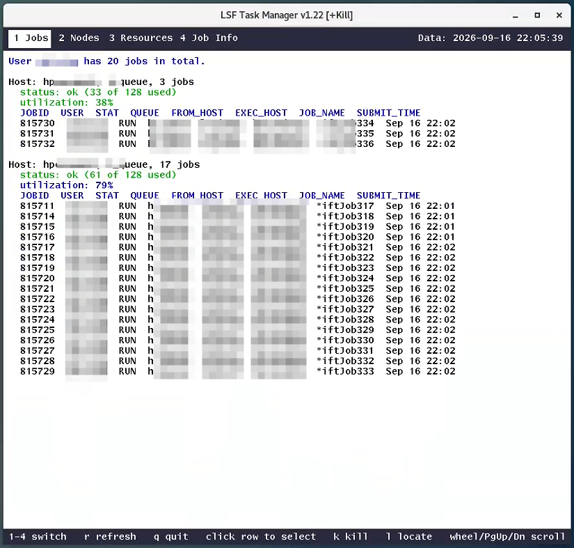
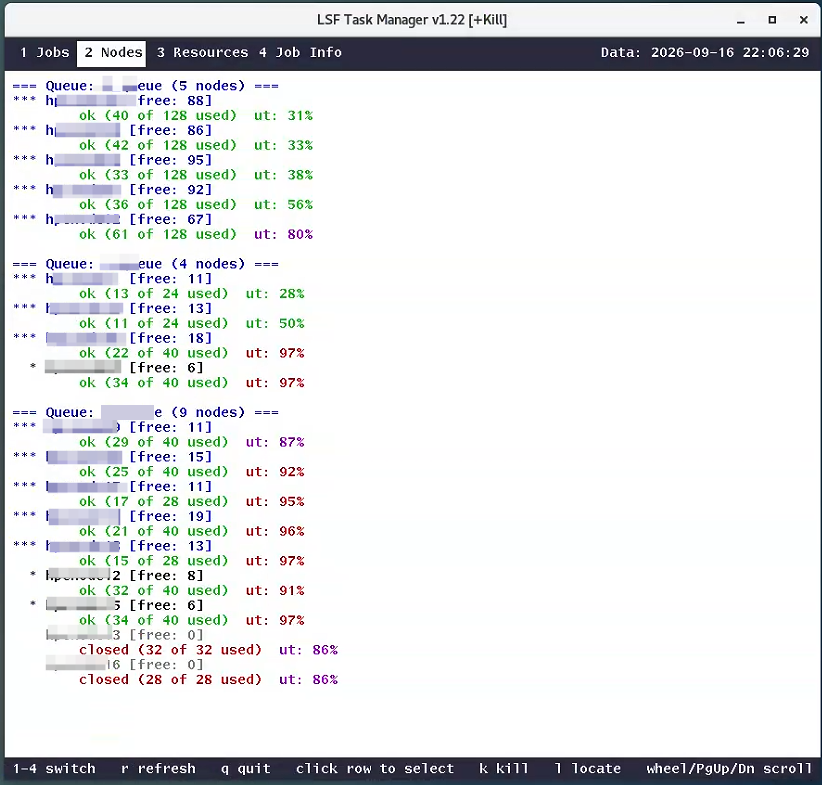
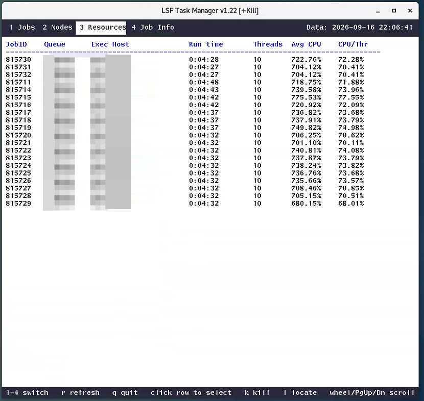
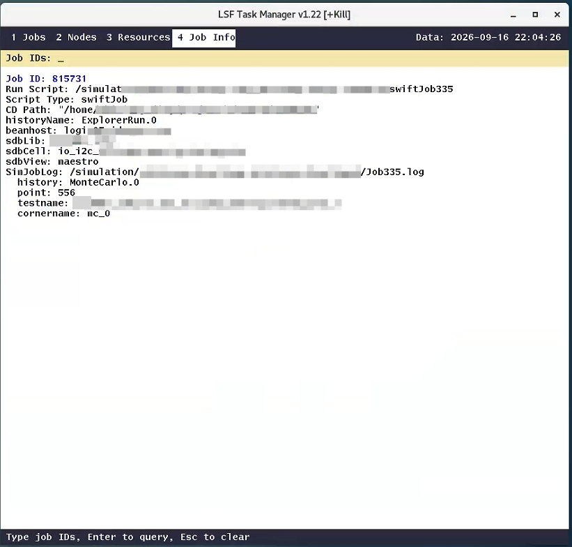

# LSF_Taskmgr

X11 LSF Task manager written in C, mainly for virtuoso ADE Explorer / Assembler.

`lsf_taskmgr` is an X11 GUI that combines the functionality of four LSF monitoring scripts into a single window. Each of the four tabs below targets a different aspect of the cluster.

---

## UI

### 1. Jobs



Lists every unfinished LSF job owned by the current user, **grouped by execution host**. For each host it shows:

- the queue(s) in use,
- the number of jobs running on that host,
- the node's `bhosts` status (`ok` / `closed` / …) together with a
  used-vs-max slot count,
- the node's `lsload` utilization percentage.

The individual job rows follow underneath, with the full `bjobs` columns (JobID, STAT, QUEUE, SUBMIT_TIME, …). Job rows are selectable — the selected job can be killed with `k` or located with `l`.

**Underlying commands:** `bjobs`, `bhosts`, `lsload`.

### 2. Nodes



Presents the cluster from the **queue's point of view**. It parses `bqueues -l` to obtain the host list of each queue (e.g. `h_queue`, `m_queue`, `l_queue` defined in `src/view_nodes.c`), then enriches every node with its `bhosts` status and `lsload` utilization.

Nodes are sorted into three groups and visually differentiated:

| Group | Rule | Ordering |
|---|---|---|
| Preferred | `free >= 10` | utilization ascending |
| Busy | `1 <= free <= 9` | utilization ascending |
| Closed | `free == 0` | hostname ascending |

Each node line shows its **free slot count**, `bhosts` **status** (colored), and **ut** percentage (colored by the `>=90 / >=80 / >=60` rule).

**Underlying commands:** `bqueues -l`, `bhosts`, `lsload`.


### 3. Resources



Shows **one row per running LSF job** with its resource footprint, obtained in a single `bjobs -W` call:

| Column | Meaning |
|---|---|
| `JobID` | LSF job ID |
| `Queue` | Queue the job was dispatched to |
| `Exec Host` | Node actually running the job |
| `Run time` | Wall-clock elapsed since `START_TIME` |
| `Threads` | Number of PIDs (threads) attributed to the job |
| `Avg CPU` | Average CPU consumption over the elapsed time (`CPU_USED / elapsed`) |
| `CPU/Thr` | Average CPU per thread (`Avg CPU ÷ Threads`) |

Rows whose **Avg CPU** exceeds 90 % are colored red so hot jobs stand out at a glance. No job ID has to be entered — the tab always reflects the full current job set.

**Underlying command:** `bjobs -W`.

### 4. Job Info Locate



Looks up the internal context of specific jobs — the *"what is this job actually doing"* view. The user types one or more job IDs (space-separated) into the input bar and presses **Enter**.

For each ID:

1. Resolves the job to its LSF run script (`runICRP…`, `swiftJob…`, or  `runGenricJob…`).
2. Reads the script and prints the working directory and script type.
3. Dispatches to the appropriate parser:

### runICRP

Extracts `-mpssession`, `-log`, `-mpshost`, then opens the referenced log file to pull out **Library / Cell / State Name**.

### swiftJob

Extracts `--historyName`, `-beanhost`, `--sdbLib`, `--sdbCell`, `--sdbView`; resolves `CDS_SIM_MONITOR_LOG_FILE` and reads the last JSON record to display `history`, `point`, `testname`, `cornername`.

### runGenricJob

Decodes **Library / Cell / SimView / HistoryView / TestName** directly from the script path.

This is the tab that lets you jump from *"a job is running"* to *"here is the exact Cadence library, cell, and simulation state it is operating on."*

**Underlying commands:** `bjobs -W`, plus filesystem reads of the run script and log file.

---

## Common Controls

| Key / Mouse | Action |
|---|---|
| `1` `2` `3` `4` or click tab | Switch to Jobs / Nodes / Resources / Job Info |
| `r` | Force refresh (updates the data timestamp) |
| `q` | Quit |
| `↑` `↓` | Move selection (if a row is selected) or scroll |
| `PgUp` `PgDn` | Page up / page down |
| Mouse wheel | Scroll 3 lines |
| Click a job row | Select that job (highlighted) |
| Click scrollbar / drag thumb | Scroll content |
| `k` | Kill the selected job (press twice within 5 s to confirm) |
| `l` | Locate the selected job (jumps to **Job Info** with the ID pre-filled) |
| `Enter` (Job Info) | Run the query for the typed job IDs |
| `Esc` | Clear the input bar / cancel pending kill |

The data collection timestamp is shown in the top-right corner as `Data: YYYY-MM-DD HH:MM:SS`, updated on every refresh.

---

# CLI Args

```
    -h
        Show this message, usage: lsf_taskmgr -h
    -v
        Show app version, usage: lsf_taskmgr -v
    -k (default FALSE)
        Enable kill job, usage: lsf_taskmgr -k
    -f (default -b&h-lucidatypewriter-bold-r-normal-sans-14-140-75-75-m-90-iso8859-1)
        Use user-defined X11 font, usage: lsf_taskmgr -flucidasans-bold-24
    -t (default 40)
        Define average CPU usage highlight threshold (low), usage: lsf_taskmgr -t50
    -ij (default 5)
        Define refresh interval of jobs tab (secs), usage: lsf_taskmgr -ij5
    -in (default 5)
        Define refresh interval of nodes tab (secs), usage: lsf_taskmgr -in5
    -ir (default 5)
        Define refresh interval of resources tab (secs), usage: lsf_taskmgr -ir5
```

---

### Build requirements

| Item | Minimum | Notes |
|---|---|---|
| C compiler | `gcc` 4.8 / `clang` 3.4 | C99 with `_GNU_SOURCE` |
| `make` | GNU Make 3.81 | BSD make is not supported |
| X11 development headers | `libX11` 1.6 | Provides `<X11/Xlib.h>`, `<X11/Xutil.h>`, `<X11/keysym.h>` |
| X11 runtime library | `libX11` 1.6 | Linked with `-lX11` |

### Runtime requirements

| Item | Notes |
|---|---|
| X11 display | `$DISPLAY` must be set. |
| LSF client | `bjobs`, `bhosts`, `lsload`, `bqueues`, `bkill` must be in `$PATH`. |
| LSF environment | The shell that launches `lsf_taskmgr` must have LSF configured (usually via `source /path/to/profile.lsf`). |
| Colormap | A TrueColor or PseudoColor visual with at least 9 free color cells. |

The UI degrades gracefully if some LSF commands are missing: the affected tab will show a placeholder line rather than crashing.

### Non-requirements

- **No Python** at runtime or build time.
- **No Qt / GTK / ncurses** — only `libX11`.
- **No external JSON or regex libraries** — a minimal JSON field extractor and POSIX `regcomp`/`regexec` are used.

---

## Building

### Quick build

```bash
clone repository to lsf_taskmgr
cd lsf_taskmgr
make
```

This produces `./lsf_taskmgr` in the project root. Object files and dependency files go into `build/`.

### Verbose / debug build

Override the default `CFLAGS`:

```bash
make clean
make CFLAGS="-O0 -g3 -Wall -Wextra -std=c99 -D_GNU_SOURCE"
```

The Makefile prepends `-D_GNU_SOURCE` automatically, but repeating it in the override is harmless. For stricter diagnostics:

```bash
make CFLAGS="-O2 -Wall -Wextra -Werror=implicit-function-declaration \
             -std=c99 -D_GNU_SOURCE"
```

This catches missing header includes that would otherwise degrade to warnings and fail at link time.

### Rebuild from scratch

```bash
make rebuild
```

Equivalent to `make clean && make`.

### Clean

```bash
make clean
```

Removes `build/` and the `lsf_taskmgr` binary.

### Run

```bash
chmod +x ./lsf_taskmgr # if needed
./lsf_taskmgr # or make run
```

---

## Makefile targets

| Target | Effect |
|---|---|
| `all` (default) | Build `lsf_taskmgr` |
| `run` | Build, then execute `./lsf_taskmgr` |
| `rebuild` | `clean` + `all` |
| `clean` | Delete `build/` and the binary |

The Makefile uses `-MMD -MP`, so editing any header triggers recompilation of exactly the `.c` files that include it. There is no need to `make clean` after a header change.

---

# Comment

basic code / readme by deepseek-v4.1-flash, liangzu huigui
