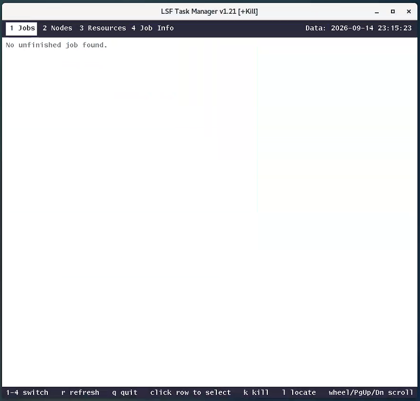

# LSF_Taskmgr

X11 LSF Task manager written in C, mainly for virtuoso ADE Explorer / Assembler

---

requirements: lsf environment (bhosts bjobs bkill...)

X11 environment: gcc lib -lX11

---

To run:

make clean && make

---

comment: basic code by deepseek-v4.1-flash, liangzu huigui
